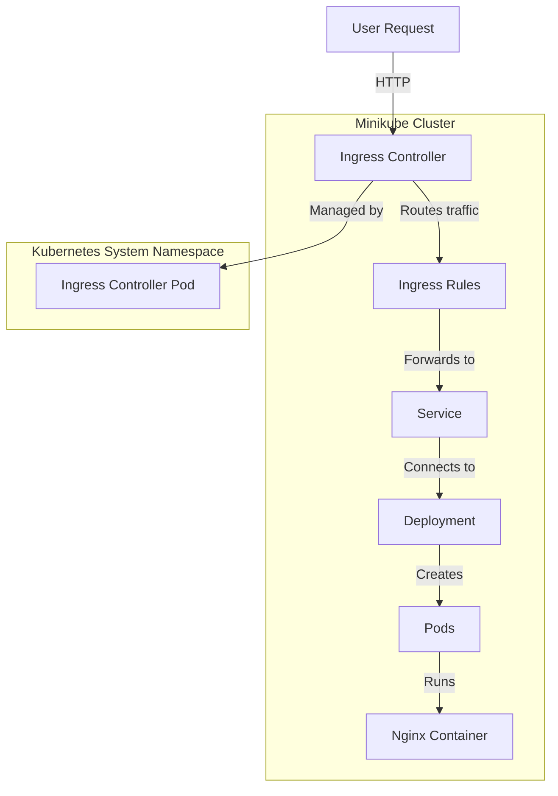

Here’s a **Mermaid diagram** showing all the components involved in making a call and testing the **Ingress** in your Minikube cluster:

### Explanation:
1. **User Request**: A request is sent to the cluster.
2. **Ingress Controller**: Manages incoming traffic.
3. **Ingress Rules**: Define routing rules for the request.
4. **Service**: Maps traffic to the correct pods.
5. **Deployment**: Ensures the desired number of pods are running.
6. **Pods**: Run the actual application, in this case, **Nginx**.
7. **Ingress Controller Pod** (in `kube-system` namespace) manages ingress resources.

Would you like to refine or add anything to this diagram? 🚀

>>>

@rifaterdemsahin ➜ /workspaces/KubernetesRoutes (main) $ minikube start
😄  minikube v1.34.0 on Ubuntu 20.04 (docker/amd64)
🎉  minikube 1.35.0 is available! Download it: https://github.com/kubernetes/minikube/releases/tag/v1.35.0
💡  To disable this notice, run: 'minikube config set WantUpdateNotification false'

✨  Automatically selected the docker driver. Other choices: none, ssh
📌  Using Docker driver with root privileges
👍  Starting "minikube" primary control-plane node in "minikube" cluster
🚜  Pulling base image v0.0.45 ...
💾  Downloading Kubernetes v1.31.0 preload ...
    > preloaded-images-k8s-v18-v1...:  326.69 MiB / 326.69 MiB  100.00% 206.78 
    > gcr.io/k8s-minikube/kicbase...:  487.90 MiB / 487.90 MiB  100.00% 33.71 M
🔥  Creating docker container (CPUs=2, Memory=2200MB) ...
🐳  Preparing Kubernetes v1.31.0 on Docker 27.2.0 ...
    ▪ Generating certificates and keys ...
    ▪ Booting up control plane ...
    ▪ Configuring RBAC rules ...
🔗  Configuring bridge CNI (Container Networking Interface) ...
🔎  Verifying Kubernetes components...
    ▪ Using image gcr.io/k8s-minikube/storage-provisioner:v5
🌟  Enabled addons: default-storageclass, storage-provisioner
🏄  Done! kubectl is now configured to use "minikube" cluster and "default" namespace by default
@rifaterdemsahin ➜ /workspaces/KubernetesRoutes (main) $ kubectl get nodes
NAME       STATUS   ROLES           AGE   VERSION
minikube   Ready    control-plane   69s   v1.31.0
@rifaterdemsahin ➜ /workspaces/KubernetesRoutes (main) $ 
@rifaterdemsahin ➜ /workspaces/KubernetesRoutes (main) $ kubectl apply -f /workspaces/KubernetesRoutes/6_Symbols/SetUp/your-deployment.yaml
deployment.apps/nginx-deployment created
@rifaterdemsahin ➜ /workspaces/KubernetesRoutes (main) $ minikube addons enable ingress
💡  ingress is an addon maintained by Kubernetes. For any concerns contact minikube on GitHub.
You can view the list of minikube maintainers at: https://github.com/kubernetes/minikube/blob/master/OWNERS
    ▪ Using image registry.k8s.io/ingress-nginx/kube-webhook-certgen:v1.4.3
    ▪ Using image registry.k8s.io/ingress-nginx/kube-webhook-certgen:v1.4.3
    ▪ Using image registry.k8s.io/ingress-nginx/controller:v1.11.2
🔎  Verifying ingress addon...
🌟  The 'ingress' addon is enabled
@rifaterdemsahin ➜ /workspaces/KubernetesRoutes (main) $ ^C
@rifaterdemsahin ➜ /workspaces/KubernetesRoutes (main) $ kubectl get nodes
NAME       STATUS   ROLES           AGE    VERSION
minikube   Ready    control-plane   4m2s   v1.31.0
@rifaterdemsahin ➜ /workspaces/KubernetesRoutes (main) $ kubectl get pods
NAME                               READY   STATUS    RESTARTS   AGE
nginx-deployment-d556bf558-cqpbm   1/1     Running   0          2m20s
nginx-deployment-d556bf558-f8tlq   1/1     Running   0          2m20s
nginx-deployment-d556bf558-m8k46   1/1     Running   0          2m20s
@rifaterdemsahin ➜ /workspaces/KubernetesRoutes (main) $    minikube addons list | grep ingress
| ingress                     | minikube | enabled ✅   | Kubernetes                     |
| ingress-dns                 | minikube | disabled     | minikube                       |
@rifaterdemsahin ➜ /workspaces/KubernetesRoutes (main) $    kubectl get pods -n kube-system | grep ingress
@rifaterdemsahin ➜ /workspaces/KubernetesRoutes (main) $    kubectl get pods -n kube-system
NAME                               READY   STATUS    RESTARTS        AGE
coredns-6f6b679f8f-bn7kp           1/1     Running   0               6m44s
etcd-minikube                      1/1     Running   0               6m49s
kube-apiserver-minikube            1/1     Running   0               6m49s
kube-controller-manager-minikube   1/1     Running   0               6m49s
kube-proxy-5txk4                   1/1     Running   0               6m45s
kube-scheduler-minikube            1/1     Running   0               6m49s
storage-provisioner                1/1     Running   1 (6m13s ago)   6m47s
@rifaterdemsahin ➜ /workspaces/KubernetesRoutes (main) $ 
main) $    kubectl get pods -n k@rifaterdemsahin ➜ /workspaces/KubernetesRoutes (main) $ @rifaterdemsahin ➜ /workspaces/KubernetesRoutes (main) $    kubectl get pods -n k
bash: syntax error near unexpected token `('
@rifaterdemsahin ➜ /workspaces/KubernetesRoutes (main) $ kubectl get svc -n kube-system | grep ingress
@rifaterdemsahin ➜ /workspaces/KubernetesRoutes (main) $ kubectl get svc -n kube-system
NAME       TYPE        CLUSTER-IP   EXTERNAL-IP   PORT(S)                  AGE
kube-dns   ClusterIP   10.96.0.10   <none>        53/UDP,53/TCP,9153/TCP   8m7s
@rifaterdemsahin ➜ /workspaces/KubernetesRoutes (main) $    minikube ip
192.168.49.2
@rifaterdemsahin ➜ /workspaces/KubernetesRoutes (main) $ kubectl apply -f /workspaces/KubernetesRoutes/6_Symbols/SetUp/your-ingress.yaml
ingress.networking.k8s.io/example-ingress created
@rifaterdemsahin ➜ /workspaces/KubernetesRoutes (main) $ nano /etc/hosts
@rifaterdemsahin ➜ /workspaces/KubernetesRoutes (main) $ nano /etc/hosts
@rifaterdemsahin ➜ /workspaces/KubernetesRoutes (main) $ 
@rifaterdemsahin ➜ /workspaces/KubernetesRoutes (main) $ sudo nano /etc/hosts
@rifaterdemsahin ➜ /workspaces/KubernetesRoutes (main) $ sudo nano /etc/hosts
@rifaterdemsahin ➜ /workspaces/KubernetesRoutes (main) $  curl http://example.local
<html>
<head><title>503 Service Temporarily Unavailable</title></head>
<body>

<h1>503 Service Temporarily Unavailable</h1>

nginx

</body>
</html>
@rifaterdemsahin ➜ /workspaces/KubernetesRoutes (main) $  curl http://example.local2
curl: (6) Could not resolve host: example.local2